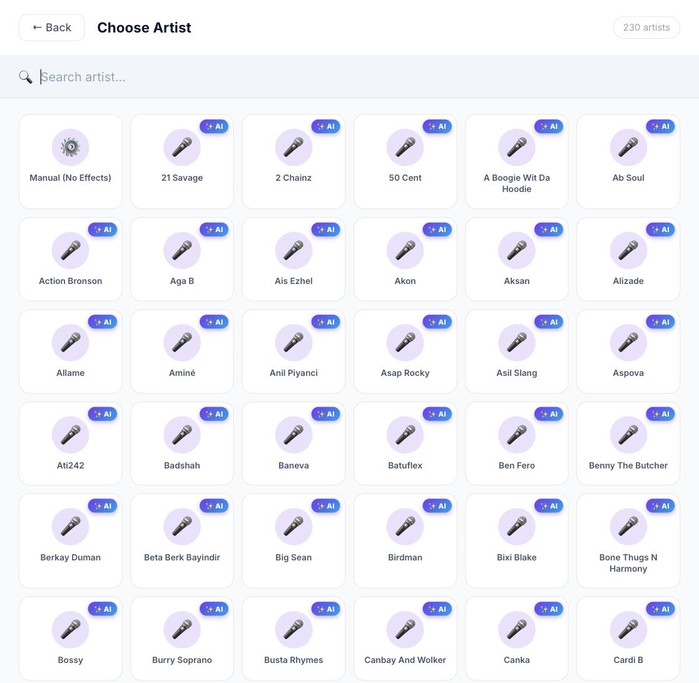
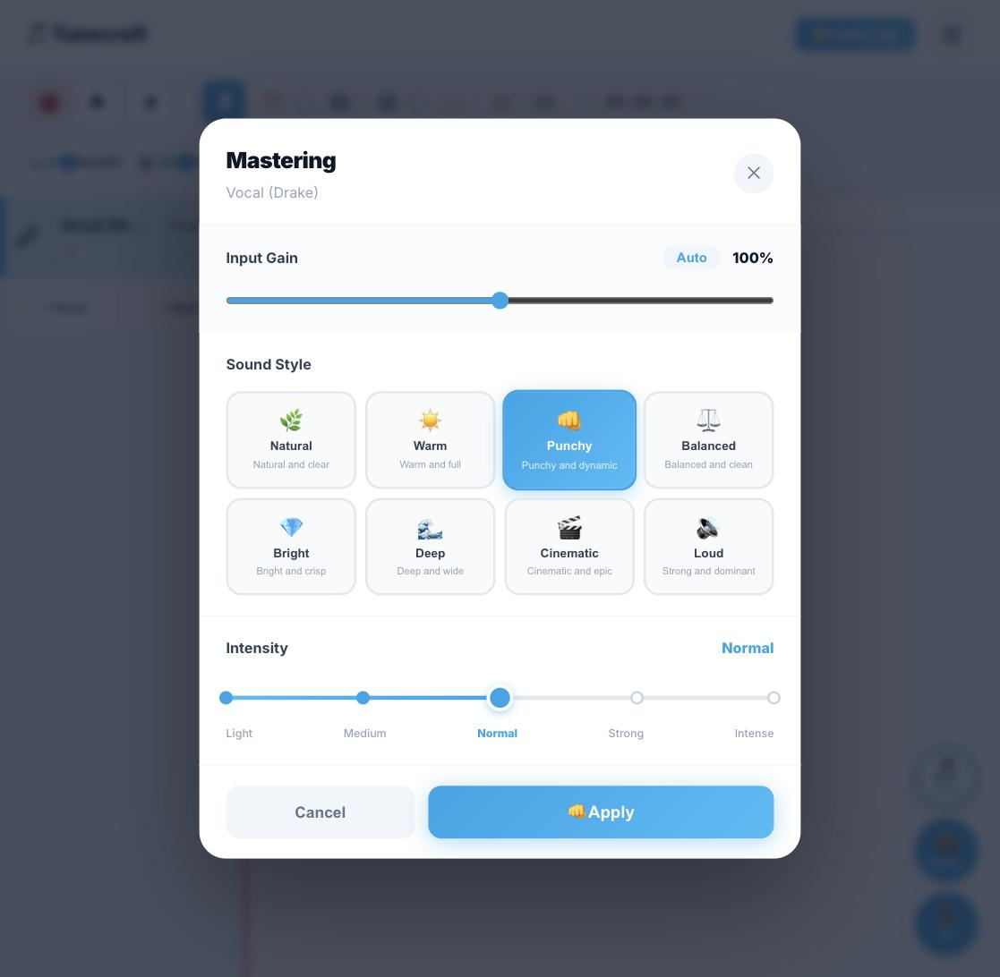
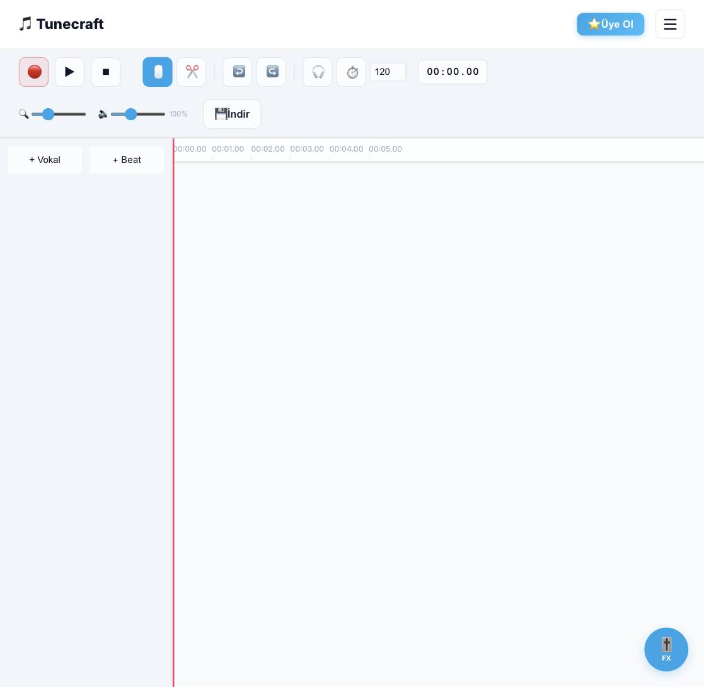

# Tunecraft AI Studio

Tunecraft AI Studio is an AI-powered web application designed to apply professional vocal processing chains and autotune presets inspired by over 230 famous artists. Built with React and FastAPI, it features local audio processing using Librosa, PSOLA, and Pedalboard, offering real-time pitch correction, EQ, compression, and rich reverb effects. 🎤🎛️

## Features
- **AI-Driven Vocal Processing:** AI-assisted pitch correction and mastering tuned to each artist's vocal signature.
- **Professional Presets:** Access over 230 artist-inspired vocal chains.
- **Local Processing:** High-performance audio manipulation using Python-based tools.
- **Real-time Effects:** Pitch correction, EQ, and compression built for studio-quality sound.

## Screenshots

### Artist List
Browse and search over 230 artist presets, each tuned by AI.

### AI Vocal Matching
Pick an artist and Tunecraft's AI tunes the vocal chain (EQ, reverb, autotune) to match their signature sound.

### Studio

### Subscription

